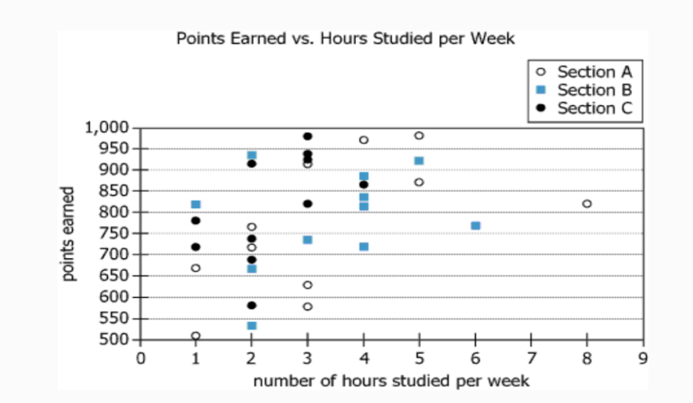

# Quick Math Shortcut for 3-Minute Problem Solving

## Instruction
Provide a shortcut method that a human can solve a math problem in 3 minutes using only paper, pencil, and visual estimation. The principle is: the fewer calculations, the simpler the numbers, and the simpler and fewer the formulas, the better. If substituting numbers or using visual guessing is simpler, feel free to adopt that approach.

## Function
Offer a quick math shortcut that minimizes computation, enhances exam efficiency, and simplifies calculations.

## Suitable For
- Candidates with a basic foundation but slow problem-solving speed.
- Test-takers aiming for greater time efficiency during the exam.
- Those who struggle with cumbersome calculations.
- Suitable for Graph and Table problems in where a quick, efficient approach is beneficial.

## Example
**Input:**  


```
At the end of last semester, all 33 students (11 from each of 3 sections) of a particular course were asked how many hours per week they spent studying for the course. This data was combined with the number of points earned by each student in the course. This information is presented in the graph.

Grades in the course were calculated using a 20-point scale. To compute the grade, the number of points earned in the course was divided by 50 and then rounded up to the next whole number.

Use the drop-down menus to complete each statement so that it is consistent with the information provided.

The median reported time spent studying for all students in the course was________ hours per week.

Choices: 2 / 2.5 / 3 / 3.5
Section________ had the smallest average (arithmetic mean) reported time spent studying per week.
Choices: A / B / C

----

Provide a shortcut method that a human can solve a math problem in 3 minutes using only paper, pencil, and visual estimation. The principle is: the fewer calculations, the simpler the numbers, and the simpler and fewer the formulas, the better. If substituting numbers or using visual guessing is simpler, feel free to adopt that approach.
```

**Output:**  

1. **Identify the Median**  
   - **Tally Method**: Scan the horizontal axis and count how many data points (all 33 combined) fall at or below each hour mark: 0–1 hr, 1–2 hrs, 2–3 hrs, etc.  
   - You need the 17th point (because 33 total, so median is the 17th). When your running total crosses 17, that hour mark is the median.  
   - By quick visual count, you’ll see the 17th point near **3 hours**.

2. **Find the Section with the Smallest Average**  
   - Each section (A, B, C) has 11 students. Focus on one section at a time (e.g., black circles for C).  
   - **Approximate each student’s hours** to the nearest whole number (e.g., 2.2 becomes 2, 3.7 becomes 4).  
   - **Add** those approximate hours for all 11 students in the section. Then **divide by 11** to get an average.  
   - Do the same for each section. The section with the **lowest** result is your answer.  
   - A quick glance suggests **Section C** has more points clustered toward fewer hours, thus **smallest average**.

**Final Answers**
- **Median Study Hours:** 3 hours/week  
- **Section with Smallest Average:** C
