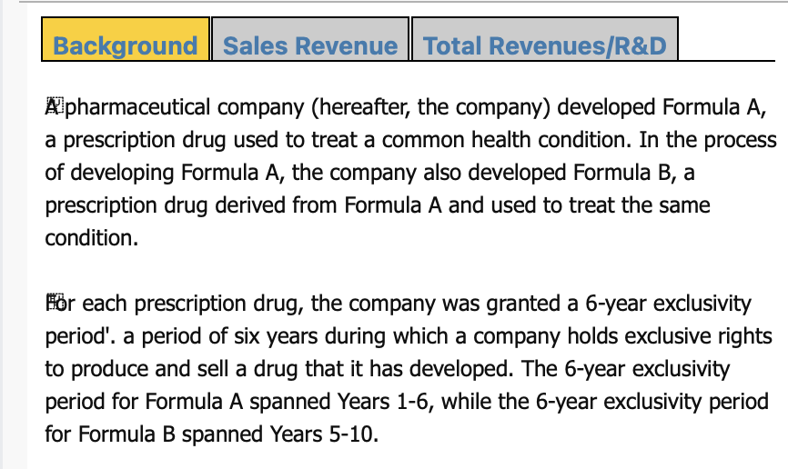
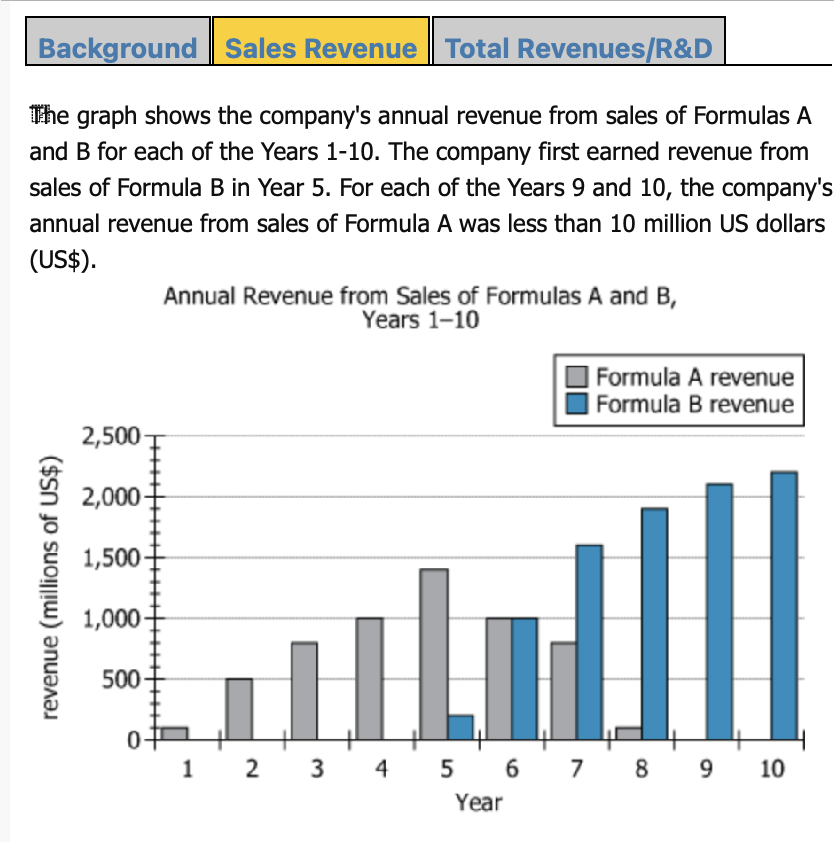
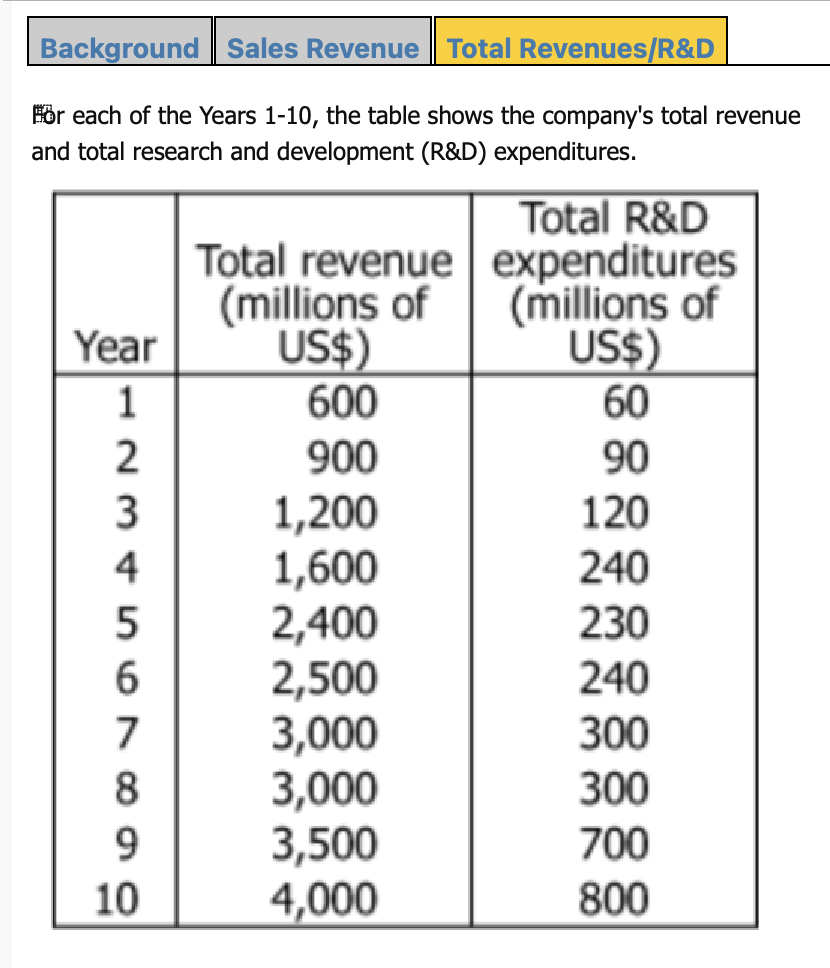

# Quick Absorption of 3 MSR Tabs in 1.5-2.5 Minutes

## Instruction
How can I quickly absorb these tabs of information (shown in photos uploaded) within 1.5-2.5 minutes? Please recommend a reading order and the key points to focus on, along with your reasoning.

## Function
Guide candidates on how to rapidly process and absorb three separate pieces of information within 1.5-2.5 minutes (adjustable).

Provide a recommended reading sequence and highlight key focus areas, with detailed reasoning for each recommendation.

## Suitable For
- Candidates who read slowly and cannot quickly absorb information in solving MSR question.
- Test-takers who are unclear about how to filter and extract key points from multiple sources.
- Those who need to enhance their information processing efficiency within a short time frame.

## Example
**Input:**  





```
How can I quickly absorb these tabs of information (shown in photos uploaded) within 1.5-2.5 minutes? Please recommend a reading order and the key points to focus on, along with your reasoning.
```

**Output:**  

|
**1. Background Tab (First ~30 seconds)**
   - **Why**: Establish the core scenario.  
   - **What to Notice**:  
     - The **pharmaceutical context** (Formulas A & B).  
     - **Exclusivity periods**: A = Years 1–6, B = Years 5–10.  
     - **Purpose**: Summarize how each formula emerged and the competitive advantage window.

**2. Sales Revenue Tab (Next ~40 seconds)**
   - **Why**: Pinpoint how each drug performs financially year by year.  
   - **What to Notice**:  
     - **Bar chart**: Annual revenue from A and B across Years 1–10.  
     - **First year B** has revenue (Year 5).  
     - Any **significant dips/spikes** (e.g., Years 9 and 10 for Formula A).

**3. Total Revenues/R&D Tab (Final ~30–40 seconds)**
   - **Why**: See overall company performance and R&D investments.  
   - **What to Notice**:  
     - **Total revenue** each year (includes both Formulas and possibly other income sources).  
     - **R&D expenditures** for each year—observe major changes that might explain product shifts.

**Reasoning Behind This Order**
1. **Context First**: The *Background* clarifies the essential storyline (new drug, exclusivity timeline). Without it, data on the other tabs is less meaningful.  
2. **Product-Specific Data**: The *Sales Revenue* tab directly shows how each formula contributes over time—vital for questions about year-to-year sales or combined revenues.  
3. **Company-Wide Figures**: The *Total Revenues/R&D* tab offers a macro-level perspective, which is best interpreted after understanding each product’s revenue stream.
